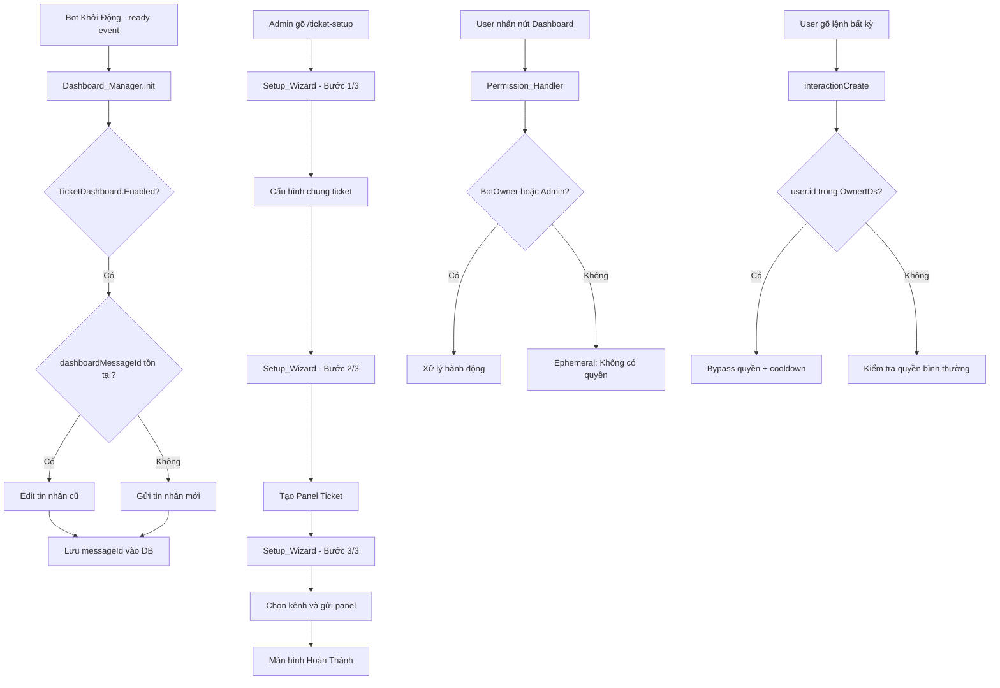
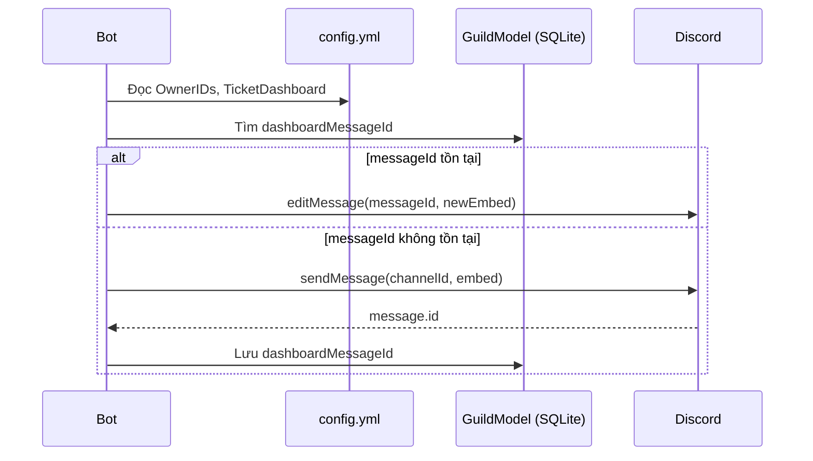
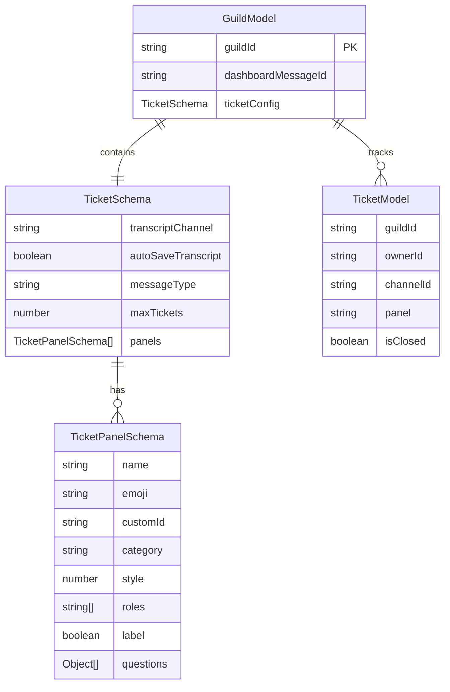

# Tài Liệu Thiết Kế: ticket-setup-dashboard

## Overview

Feature **ticket-setup-dashboard** bổ sung ba cải tiến lớn cho hệ thống ticket của Discord bot Heiznerd:

1. **Setup Wizard 3 bước** (`/ticket-setup`): Luồng hướng dẫn liền mạch thay thế việc gõ nhiều lệnh riêng lẻ.
2. **Dashboard_Ticket tự động**: Tin nhắn embed tương tác được gửi/cập nhật vào kênh quản lý khi bot khởi động.
3. **Hệ thống OwnerIDs**: Danh sách user ID đặc biệt trong `config.yml` được bypass toàn bộ kiểm tra quyền và cooldown.

Codebase sử dụng Discord.js v14, Node.js (CommonJS), SQLite thông qua adapter `sqliteDb.js` (mongoose-compatible API), và YAML cho cấu hình.

---

## Architecture



### Luồng Dữ Liệu



---

## Components and Interfaces

### 1. Config_Manager (mở rộng `Client.js`)

Không tạo module riêng — mở rộng logic đọc config hiện có trong `ExtendedClient`.

**Thay đổi `config/config.yml`:**
```yaml
OwnerIDs:
  - "123456789012345678"

TicketDashboard:
  Enabled: true
  ChannelId: "987654321098765432"
```

**Validation khi load:**
- Đọc `OwnerIDs` dưới dạng `string[]`, mặc định `[]` nếu không có.
- Validate từng ID: phải là chuỗi số, độ dài 17-19 ký tự (Discord Snowflake).
- Log warning cho ID không hợp lệ, bỏ qua khỏi danh sách.
- Giới hạn tối đa 10 IDs.

### 2. Permission_Handler (sửa `interactionCreate.js`)

**Thêm BotOwner bypass trước tất cả kiểm tra quyền:**
```javascript
const isBotOwner = client.config.OwnerIDs?.includes(interaction.user.id);
if (isBotOwner) {
  // Bỏ qua kiểm tra quyền và cooldown
  await command.run({ client, interaction });
  return;
}
```

**Thứ tự kiểm tra:**
1. `isBotOwner` → bypass tất cả
2. `isOwner` (guild owner)
3. `isAdmin` (Administrator permission)
4. Role/ID trong Permissions config

### 3. Dashboard_Manager (`src/helpers/dashboardManager.js`)

Module mới, được gọi từ sự kiện `ready`.

**Interface chính:**
```javascript
class DashboardManager {
  constructor(client) { ... }
  
  // Gọi khi bot ready - gửi hoặc cập nhật dashboard cho tất cả guilds
  async init() { ... }
  
  // Tạo embed dashboard với thống kê ticket
  buildDashboardEmbed(guildData, openCount, closedCount) { ... }
  
  // Tạo action row với 4 nút
  buildDashboardButtons(disabled = false) { ... }
  
  // Xử lý button interaction từ dashboard
  async handleInteraction(interaction) { ... }
  
  // Kiểm tra quyền BotOwner hoặc Admin
  hasPermission(interaction) { ... }
}
```

**Custom IDs cho buttons:**
- `tkt-dashboard-view` — Xem danh sách tickets
- `tkt-dashboard-create` — Tạo panel mới
- `tkt-dashboard-send` — Gửi panel tới kênh
- `tkt-dashboard-delete` — Xóa panel

### 4. Setup_Wizard (`src/commands/admin/ticket-setup.js`)

Lệnh slash `/ticket-setup` không có subcommand.

**State object trong bộ nhớ (per-interaction):**
```javascript
const wizardState = {
  step: 1,           // 1 | 2 | 3
  ticketConfig: {    // Bước 1
    maxTickets: null,
    transcriptChannel: null,
    autoSaveTranscript: null,
    messageType: null,
  },
  panel: {           // Bước 2
    name: null,
    emoji: null,
    category: null,
    roles: [],
    style: 1,
    label: true,
    questions: [],
  },
  targetChannel: null, // Bước 3
};
```

**Luồng bước:**
- **Bước 1/3**: Hiển thị embed với 4 field (maxTickets, transcriptChannel, autoSaveTranscript, messageType). Mỗi field có nút bấm để cấu hình. Nút "Tiếp theo" xuất hiện khi đủ field bắt buộc.
- **Bước 2/3**: Tái sử dụng logic từ `ticket-manage.js setup`. Nút "Bỏ qua" nếu đã có panel.
- **Bước 3/3**: ChannelSelectMenu để chọn kênh gửi. Nút "Gửi Panel" để xác nhận.
- **Hoàn thành**: Embed tóm tắt + nút "🏠 Về Dashboard".

**Thanh tiến trình:**
```
━━━●────── Bước 1/3
━━━━━━●─── Bước 2/3
━━━━━━━━━● Bước 3/3
```

### 5. Màn Hình Xem Tickets (`tkt-dashboard-view`)

Pagination embed, 5 tickets/trang.

**Mỗi ticket hiển thị:**
```
• <#channelId> | <@ownerId> | Panel: tên | <t:timestamp:R>
```

**Buttons:**
- `◀ Trước` (disabled ở trang 1)
- `▶ Sau` (disabled ở trang cuối)
- `🏠 Dashboard`

---

## Data Models

### Thay Đổi GuildModel

Thêm field `dashboardMessageId` vào schema chính (không phải trong `ticketConfig`):

```javascript
// Trong schema chính của GuildModel
dashboardMessageId: { type: String, default: null }
```

**Lý do**: `dashboardMessageId` là metadata của bot, không phải cấu hình ticket. Đặt ở cấp guild phù hợp hơn.

### Cấu Trúc Dữ Liệu Hiện Có (Không Thay Đổi)

`TicketSchema` trong `GuildModel` đã có đủ các field cần thiết:
- `transcriptChannel`, `autoSaveTranscript`, `messageType`, `maxTickets`
- `panels[]` với `TicketPanelSchema`

`TicketModel` đã có `isClosed` để phân biệt ticket mở/đóng.

### Sơ Đồ Quan Hệ



---

## Correctness Properties

*Một thuộc tính là đặc điểm hoặc hành vi phải đúng trong mọi lần thực thi hợp lệ của hệ thống — về cơ bản là một phát biểu hình thức về những gì hệ thống phải làm. Các thuộc tính đóng vai trò là cầu nối giữa đặc tả có thể đọc được bởi con người và đảm bảo tính đúng đắn có thể xác minh bằng máy.*

### Property 1: Thanh tiến trình wizard luôn phản ánh đúng bước hiện tại

*Với bất kỳ* bước nào trong Setup_Wizard (1, 2, hoặc 3), embed được hiển thị phải chứa chuỗi "Bước X/3" với X là số bước hiện tại, và thanh tiến trình phải có đúng số ký tự `●` tương ứng.

**Validates: Requirements 1.7**

---

### Property 2: Hủy wizard ở bất kỳ bước nào vẫn bảo toàn tiến trình đã lưu

*Với bất kỳ* bước nào (1, 2, hoặc 3) mà admin hủy Setup_Wizard, dữ liệu đã được lưu ở các bước trước đó phải vẫn còn trong cơ sở dữ liệu và không bị xóa.

**Validates: Requirements 1.5**

---

### Property 3: Dashboard embed luôn phản ánh đúng trạng thái ticket hiện tại

*Với bất kỳ* tập hợp ticket và panel nào trong cơ sở dữ liệu, embed Dashboard_Ticket phải hiển thị đúng: số ticket đang mở (isClosed = false), số ticket đã đóng (isClosed = true), và danh sách tên các panel hiện có.

**Validates: Requirements 2.5**

---

### Property 4: Dashboard_Manager luôn edit thay vì gửi mới khi có messageId

*Với bất kỳ* message ID hợp lệ nào được lưu trong `dashboardMessageId` của GuildModel, khi Dashboard_Manager khởi tạo, nó phải gọi `message.edit()` thay vì `channel.send()`.

**Validates: Requirements 2.3**

---

### Property 5: Lỗi kênh không hợp lệ không làm gián đoạn khởi động bot

*Với bất kỳ* channel ID không hợp lệ hoặc kênh không tồn tại nào được cấu hình trong `TicketDashboard.ChannelId`, Dashboard_Manager phải bắt lỗi, ghi log, và tiếp tục mà không throw exception ra ngoài.

**Validates: Requirements 2.4**

---

### Property 6: Message ID dashboard được lưu sau mỗi lần gửi

*Với bất kỳ* tin nhắn dashboard nào được gửi thành công, `dashboardMessageId` trong GuildModel phải được cập nhật thành ID của tin nhắn vừa gửi, và có thể truy xuất lại bằng `guilds().get(guildId)`.

**Validates: Requirements 2.9**

---

### Property 7: User không có quyền luôn nhận ephemeral error khi tương tác dashboard

*Với bất kỳ* user ID nào không nằm trong `OwnerIDs` và không có quyền `Administrator`, khi tương tác với bất kỳ nút nào trên Dashboard_Ticket, phải nhận phản hồi ephemeral với thông báo không có quyền.

**Validates: Requirements 2.8, 4.4**

---

### Property 8: Config_Manager parse đúng mọi danh sách OwnerIDs hợp lệ

*Với bất kỳ* danh sách OwnerIDs hợp lệ nào (0 đến 10 Discord Snowflake ID), `client.config.OwnerIDs` sau khi load phải là một mảng chứa đúng các ID đó dưới dạng chuỗi.

**Validates: Requirements 3.1, 3.6**

---

### Property 9: BotOwner bypass quyền cho mọi lệnh

*Với bất kỳ* lệnh nào yêu cầu quyền cụ thể, nếu `interaction.user.id` nằm trong `OwnerIDs`, Permission_Handler phải cho phép thực thi mà không kiểm tra `isOwner`, `isAdmin`, hay role.

**Validates: Requirements 3.3, 3.4, 4.1, 4.2**

---

### Property 10: BotOwner bypass cooldown cho mọi lệnh

*Với bất kỳ* lệnh nào có cooldown đang active, nếu `interaction.user.id` nằm trong `OwnerIDs`, Cooldown_Manager phải bỏ qua kiểm tra cooldown và cho phép thực thi ngay lập tức.

**Validates: Requirements 3.5**

---

### Property 11: Config_Manager bỏ qua và log warning cho Snowflake không hợp lệ

*Với bất kỳ* giá trị nào trong `OwnerIDs` không phải là chuỗi số hợp lệ (không phải Discord Snowflake), Config_Manager phải ghi log warning cho giá trị đó và không đưa nó vào danh sách `OwnerIDs` cuối cùng.

**Validates: Requirements 3.7**

---

## Error Handling

### Dashboard_Manager

| Tình huống | Xử lý |
|---|---|
| Kênh không tồn tại | Log error, bỏ qua guild đó, tiếp tục init |
| Bot không có quyền gửi tin | Log error, bỏ qua guild đó, tiếp tục init |
| Message cũ bị xóa | Gửi tin nhắn mới, cập nhật messageId trong DB |
| DB lỗi khi lưu messageId | Log error, không crash bot |
| Interaction timeout (collector) | Disable buttons, hiển thị thông báo hết giờ |

### Setup_Wizard

| Tình huống | Xử lý |
|---|---|
| Timeout 300 giây | Kết thúc collector, disable buttons, thông báo hết giờ |
| Admin hủy | Lưu tiến trình đã hoàn thành, thông báo hủy |
| Kênh gửi panel không hợp lệ | Thông báo lỗi, cho phép chọn lại |
| Panel đã tồn tại cùng tên | Thông báo trùng tên, yêu cầu đặt tên khác |

### Permission_Handler

| Tình huống | Xử lý |
|---|---|
| OwnerIDs không có trong config | Dùng mảng rỗng, không lỗi |
| ID không hợp lệ trong OwnerIDs | Log warning, bỏ qua ID đó |
| User không có quyền | Reply embed đỏ "Không có quyền" |

---

## Testing Strategy

### Phương Pháp Kiểm Thử Kép

Feature này sử dụng kết hợp:
- **Unit tests**: Kiểm tra các hàm thuần túy (buildDashboardEmbed, buildProgressBar, validateSnowflake, hasPermission)
- **Property-based tests**: Kiểm tra các thuộc tính tổng quát trên nhiều input khác nhau

### Thư Viện Property-Based Testing

Sử dụng **[fast-check](https://github.com/dubzzz/fast-check)** — thư viện PBT phổ biến nhất cho JavaScript/TypeScript, hỗ trợ tốt với Node.js CommonJS.

```bash
npm install --save-dev fast-check
```

### Cấu Hình Property Tests

- Mỗi property test chạy tối thiểu **100 lần lặp** (fast-check mặc định là 100).
- Mỗi test được tag với comment: `// Feature: ticket-setup-dashboard, Property N: <mô tả>`

### Phân Loại Tests

**Unit Tests (example-based):**
- Kiểm tra lệnh `/ticket-setup` hiển thị đúng bước 1/3
- Kiểm tra chuyển bước tự động sau khi hoàn thành
- Kiểm tra 4 nút dashboard luôn hiển thị
- Kiểm tra timeout 300 giây kết thúc phiên
- Kiểm tra Admin có thể thực hiện tất cả hành động dashboard

**Property-Based Tests:**
- Thuộc tính 1: Thanh tiến trình đúng với mọi bước (1, 2, 3)
- Thuộc tính 2: Hủy ở bất kỳ bước nào bảo toàn dữ liệu đã lưu
- Thuộc tính 3: Embed dashboard phản ánh đúng trạng thái DB
- Thuộc tính 4: Edit thay vì send khi có messageId
- Thuộc tính 5: Lỗi kênh không crash bot
- Thuộc tính 6: MessageId được lưu sau khi gửi
- Thuộc tính 7: User không quyền nhận ephemeral error
- Thuộc tính 8: Parse OwnerIDs đúng với mọi danh sách hợp lệ
- Thuộc tính 9: BotOwner bypass quyền mọi lệnh
- Thuộc tính 10: BotOwner bypass cooldown mọi lệnh
- Thuộc tính 11: Snowflake không hợp lệ bị log và bỏ qua

**Integration Tests:**
- Bot khởi động với `TicketDashboard.Enabled: true` → dashboard được gửi
- Nhấn nút dashboard → Dashboard_Ticket được cập nhật sau action

### Cấu Trúc Thư Mục Tests

```
src/
  tests/
    unit/
      dashboardManager.test.js
      setupWizard.test.js
      permissionHandler.test.js
      configManager.test.js
    property/
      dashboardProperties.test.js
      permissionProperties.test.js
      configProperties.test.js
```
